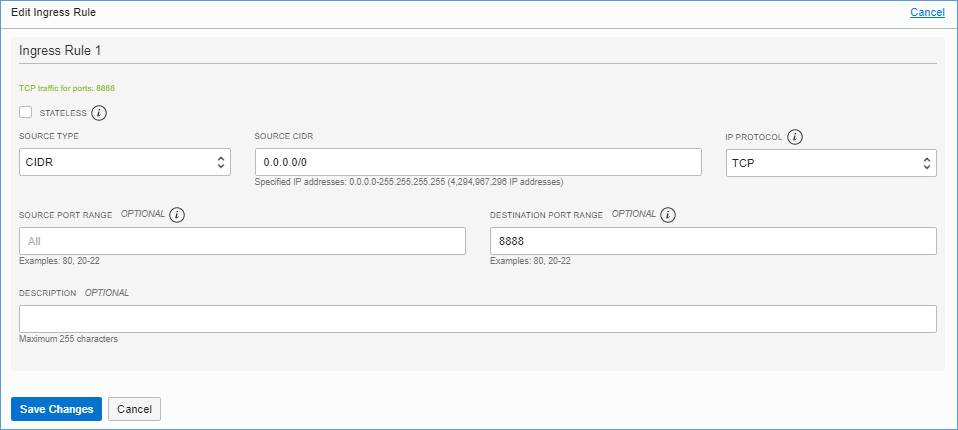
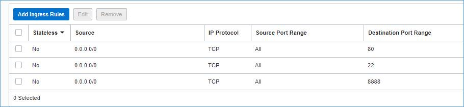

# Research Image Sandbox
Developed by Oracle for Research

## Goal 
Provide researcher with 
1. Sandbox environments to get researhers quickly up and running.
2. Researcher may need separate CPU and GPU images

## Overview
This repository includes 
1. Images that can be quickly imported by researchers.
2. Images are developed and supported by Oracle for Research
3. A research gateway image that can be used as a SSH entry point to other researcher subnets

## Software & Versions
2. [Included software versions](https://github.com/OracleForResearch/AIMLSandbox/blob/main/SoftwareAndVersion)

## Downloads
Distributed from Oracle for Research object store
#### AI/ML Sandbox 
The AI/ML Sandbox images are specifically developed in addition to OCI All-in-one Data science image. They provide a simplified and updated install base Anaconda based AI/ML software libraries for researchers to jump start their ML/DL executions using python libraries and Jupyter notebook. Compatible versions for Oracle Linux/Ubuntu and GPU/CPU Tensor flow libraries are built separately. 

1. [AI/ML Sandbox-OL7.8-CPU](https://github.com/OracleForResearch/AIMLSandbox/blob/main/images/MLSandboxTFCPU-OL78.md) - Supported with Tensor flow CPU version on all CPU shapes
2. [AI/ML Sandbox-OL7.8-GPU](https://github.com/OracleForResearch/AIMLSandbox/blob/main/images/MLSandboxTFGPU-OL78.md) - Supported with Tensor flow GPU version on all GPU shapes
3. [AI/ML Sandbox-Ubuntu16.04-CPU](https://github.com/OracleForResearch/AIMLSandbox/blob/main/images/MLSandboxTFCPU-Ubuntu18.04.md) - Supported with Tensor flow CPU version on all CPU shapes
4. [AI/ML Sandbox-Ubuntu16.04-GPU](https://github.com/OracleForResearch/AIMLSandbox/blob/main/images/MLSandboxTFGPU-Ubuntu18.04.md) - Supported with Tensor flow GPU version on all GPU shapes

#### Afni Sandbox
Analysis of Functional NeuroImages (AFNI) is an open-source environment for processing and displaying functional MRI data—a technique for mapping human brain activity. AFNI is an agglomeration of programs that can be used interactively or flexibly assembled for batch processing using shell script.

1. [Afni-Ubuntu-20.04v1](https://objectstorage.us-ashburn-1.oraclecloud.com/p/Umjj9GfKkP3_vRvEDbc7wsh47MQAxwOdNh5C-If82m46vDXC1D3-0lDvLCVe4TGY/n/ideqbfsd51fu/b/OFRImages/o/AFNI-Ubuntu-20.04-v1)

#### Research Gateway 
1. [Research Gateway OCI CLI](https://github.com/OracleForResearch/Research-Image-Sandbox/blob/main/ResearchGateway.md) - A research gateway image pre-installed with OCI CLI. It is recommended to use a free tier VM in a public subnet to host this VM

#### Molecular Dynamics
Molecular dynamics (MD) is a computer simulation method for analyzing the physical movements of atoms and molecules. The atoms and molecules are allowed to interact for a fixed period of time, giving a view of the dynamic "evolution" of the system.MD was originally developed in the early 1950s, following the earlier successes with Monte Carlo simulations, which themselves date back to the eighteenth century. 

NAMD and GROMACS are two poular molecular dynamics packages that is currently supported by OCI HPC platform. Researchers also other packages for MD simulations as well and hence these initial installation vresions of LAMMPS and AmberTools are developed.

1. [LAMMPS-Ubuntu16.04](https://objectstorage.us-ashburn-1.oraclecloud.com/p/fYbhNUaZHHAh1u27a69uDstH-roANMh1-mT4g9B6tYCOs86g9rpdngNuf_E67MQP/n/ideqbfsd51fu/b/OFRImages/o/LAMMPS-Ubuntu16.04-v1) - Deploy LAMMPS on Ubuntu
2. [AmberTools-Ubuntu18.04](https://objectstorage.us-ashburn-1.oraclecloud.com/p/VFpGUtuy3gMxQU34xWykn2ZymxTWI2y6kijM-T7utaGtCJIICSU_fgMeSUyZmHx_/n/ideqbfsd51fu/b/OFRImages/o/AmberTools-Ubuntu-18.04-v1) - Deploy AmberTools on Ubuntu

## Using the AI/ML Sandbox image
1. Login to your Oracle cloud tenancy and navigate to Compute --> Custom Images
2. Click Import image and specify a custom image name
3. Select "Import from an object storage URL" and paste the URL of the image as shown above
4. *NOTE : It may take some time to import the image to a custom image*
5. After successful import - proceed to create the image in a supported shape
6. Select "Create Instance" and select the custom image of your choice and create the instance on your desired OCI hardware shape
7. You can use Oracle provided SSH key (download required) or put your own SSH keys to create the instance
8. Add a security list ingress rule with port 8888 to your subnet hosting the compute instance.

The final rule should look like 

9. SSH to the instance
  * For Oracle Linux - *SSH -i PrivateKey -i opc@PublicIP -L 8888:localhost:8888*
  * For ubuntu - *SSH -i PrivateKey ubuntu@PublicIP -L 8888:localhost:8888*
10. Start Jupyter notebook 
  * Quick start - 
    <pre><code>conda activate sandbox
    jupyter notebook --ip=0.0.0.0</code></pre>
  * Secure start - Install a certificate for https communications from client browser
    * *openssl req -x509 -nodes -days 365 -newkey rsa:2048 -keyout jupyter-key.key*
    * *jupyter notebook --certfile=jupyter-cert.pem --keyfile=jupyter-key.key*
11. Connect from browser - *http://localhost:8888*
12. Enter *notebook* as the default password to login to jupyter notebook
13. To change your password login to the instance and do *jupyter notebook password* to change your password

## Hardware shape support:
* All OCI CPU shapes 
* All OCI GPU shapes 

## Requsting OFR Technology assistance: 
1. Please add the OFR SSH public key to ~/.ssh/authorized_keys file in your running instance/boot volume before requesting assistance
2. This is only required for OFR Technology team to login into your instance

## References
1. [Anaconda3-2020.07-Linux-x86_64](https://repo.anaconda.com/archive/Anaconda3-2020.07-Linux-x86_64.sh) 
2. [AFNI](https://afni.nimh.nih.gov/pub/dist/doc/htmldoc/background_install/install_instructs/steps_linux_ubuntu18.html)

