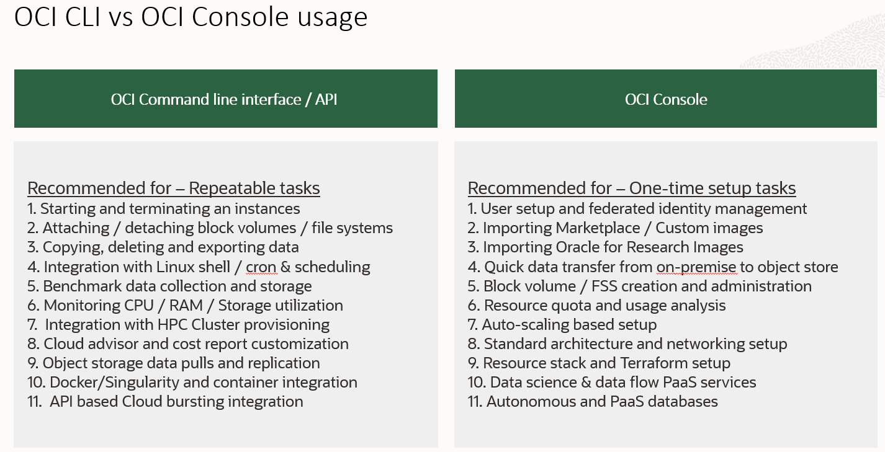

## Using the Research Gatway Image

### Overview
The Research gateway image provides a secure gateway to your researech tenancy.Some of the other usages are described below.
1. Secure gateway: Provides a secure gateway with A simple deployment. Prevents direct access to your private compute cluster and databases. 
2. Build: Should be built in a public subnet (default)
3. Architecture: Recommended to create on Oracle for Research standard architecture
4. OCI-CLI: Pre-installed version of OCI Command line interface (CLI) Tools
5. Configurable: Easily configurable to your tenancy environment
6. Operating system: Oracle Linux operating systems

### Tools and scripts 
1. Following scripts are included with the image
   * OCI-CLI object list scripts (list compartment, instances, images)
   * Instance Terminating and startup scripts
   * Block storage attachment and detachment
   * SSH to login to VM in your private subnet
   * Standard Linux monitoring examples (upcoming)
   * Using OCI Telemetry monitoring with OCI-CLI (upcoming)
   * Using NVIDIA monitoring tools with OCI-CLI (upcoming)

### Research-Gateway Image 
1. [Image URL](https://objectstorage.us-ashburn-1.oraclecloud.com/p/vaNoRJwq_U4rAguI5J8kHcnkzbVpYlBj9u9IOTMDakbldJBoGasOqe_voUqD4dr-/n/ideqbfsd51fu/b/OFRImages/o/Research-Gateway)

### Downloading and using the Image
1. Implement the Oracle for Research standard architecture
   * Create a new compartment
   * Implement a new VCN in the compartment through the VCN creation wizard
2. Import and create a custom image from the [Research-Gateway Image URL](https://objectstorage.us-ashburn-1.oraclecloud.com/p/vaNoRJwq_U4rAguI5J8kHcnkzbVpYlBj9u9IOTMDakbldJBoGasOqe_voUqD4dr-/n/ideqbfsd51fu/b/OFRImages/o/Research-Gateway)
3. Create a free-tier compute instance with the custom image in the public subnet
   * Please generate SSH key (easier if you are starting out) or use your own keys while building the instance.

### Configuring OCI CLI

OCI CLI needs some configuration to successfully work with your tenancy and the user working with it. Please follow the steps below.
1. Login to your OCI tenancy console
2. Get the Tenancy OCID - profile --> Tenancy (Top right corner of your console) and copy the OCID. This is your tenancy OCID
3. Get the user OCID - profile --> User Settngs and copy the OCID. This is your user OCID
4. Setup the API Public key
   * SSH to Research Gateway VM
   * vi ~/.oci/oci_api_key_public.pem
   * copy the contents of the file in your clipboard or notepad
   * Click on profile --> User Settngs (Top right corner of your console)
   * Navigate to API Keys 
   * Create an API key with the public key you copied
   * Copy the fingerprint
5. Setup your OCID and Tenancy Configuration
   * SSH to Research Gateway VM
   * vi ~/.oci/config
   * Update the user OCID, tenancy OCID and the region (mostly should be us-ashburn-1 unless you are allocated another OCI region)
   * Update the API fingerprint you copied from console
 6. Test with the following code 
 <pre><code>oci os ns get</code></pre>

### OCI CLI workflows 

### Guidance and recommendations
1. Build as a free-tier VM with default storage
2. Build the image instance in a public subnet
3. Use one gateway VM per compartment or VCN
4. To use a single gateway VMs across multiple project
   * Build all your instances in the same private subnet (configured through standard architecture) - simplest
   * Build project specific private subnets in the same VCN - simpler
   * Use network security rules to build SSH access between gateway VM subnet and other private subnets
5. Always SSH to private instances from Gateway instance
6. Use your own private / public SSH key pair for added security
7. Use the same API key (for multiple users) for simpler administration

### Included scripts

Scripts are present in /home/opc/scripts directory
1. get_all_comp.sh               --> gets all the compartment for a tenancy (multi-tenancy support)
2. get_all_instances.sh          --> gets all the running instances with OCID by compartment for a tenancy for easy termination (multi-tenancy support)
3. get_all_images.sh             --> gets all the images OCIDs in a file for the compartment
4. create_json.sh                --> creates the full json input file for OCI CLI Command
5. launch_vm.sh                  --> Launches a compute instance based on input json
6. terminate_vm.sh               --> Terminates a compute instance based on instance name. (works over OCID changes across multiple terminations)
7. launch_pool.sh                --> Launches an instance pool (compute cluster) based on an instance configuration
8. terminate_pool.sh             --> Terminates an instance pool (compute cluster) based on a running instance pool
9 ssh_vm.sh                     --> SSH to a VM on a private subnet. (private key on Research Gateway required) - In development
10. blockvol.sh                   --> Block volume attachment and detachment

### OCI CLI vs OCI Console usage

### Issues and resolution
Please contact Oracle for Research via the following channels 
1. OracleForResearchTech_ww@Oracle.com
2. Oracle for research update calls
